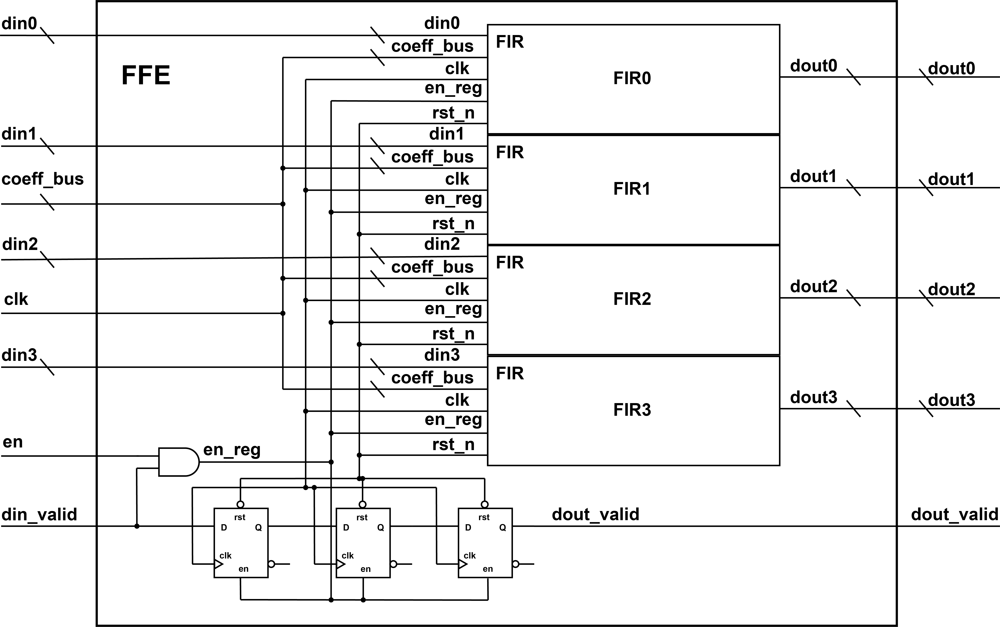
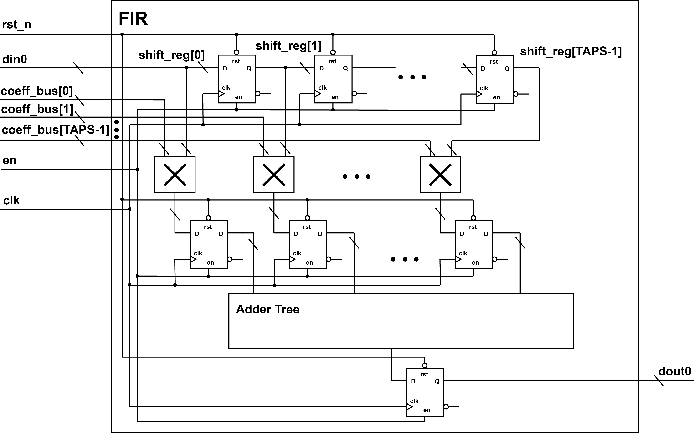
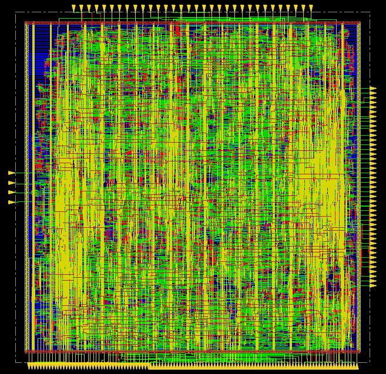

# 1. Project Overview
This project implements a digital Feed-Forward Equalizer (FFE) for the
1000BASE-T Ethernet receiver.

The goal of the design is to compensate channel-induced
Inter-Symbol Interference (ISI) in twisted-pair copper Ethernet links
using a programmable FIR-based equalizer architecture.

The project includes:
- RTL implementation in Verilog
- Cadence Genus synthesis
- RTL simulation and waveform validation
- Python golden model verification
- Cadence Innovus place-and-route
- Pegasus DRC/LVS signoff
- BER/SNR performance modeling

## Table of Contents

- [1. Project Overview](#1-project-overview)
- [2. Physical Design Flow Usage](#2-physical-design-flow-usage)
- [3. Architecture](#3-architecture)
- [4. Repository Structure](#4-repository-structure)
- [5. Design Specifications](#5-design-specifications)
- [6. RTL Simulation](#6-rtl-simulation)
- [7. Golden Model Verification](#7-golden-model-verification)
- [8. Synthesis Flow](#8-synthesis-flow)
- [9. Place & Route Flow](#9-place--route-flow)
- [10. DRC / LVS](#10-drc--lvs)
- [11. BER / SNR Evaluation](#11-ber--snr-evaluation)
- [12. Results](#12-results)
- [13. References](#13-references)
- [14. Team Members](#14-team-members)

# 2. Physical Design Flow Usage
## (1). Run Genus Synthesis

To run synthesis for the `FFE` module from the project root directory:

```bash
source env.sh
make genus
```

This flow reads the RTL, loads the SKY130 standard-cell library, applies the timing constraints in constraints/ffe.sdc, and runs syn_generic, syn_map, and syn_opt. If synthesis completes successfully, the main outputs are generated under:

build/genus/netlist/FFE_synth.v
build/genus/netlist/FFE_synth.sdc
build/genus/reports/

The generated FFE_synth.v confirms that synthesis has completed and that a gate-level netlist has been produced.

## (2). View the Design in Genus GUI

To launch the Genus GUI:

```bash
source env.sh
make genus_gui
```

If launching Genus directly from the project root, use:

```bash
genus -gui
```

After launching with `make genus_gui`, run the following Tcl script
inside the GUI command window:

```genus
set ROOT [file normalize "../.."]

set_db init_lib_search_path [list $ROOT/tech/lib]
set_db library [list sky130_tt_1.8_25_nldm.lib]

read_hdl $ROOT/build/genus/netlist/FFE_synth.v

elaborate FFE

current_design FFE
```

Then open genus GUI, choose "schematic" after clicking the "+" button next to "Layout". 

## (3). Run simulation by using vcs
Run 

```bash
source env.sh
make sim
```

from the project root directory. This generates the
`build/simulation/ffe.vpd` waveform file. To view the waveform
using DVE/Synopsys, run:

```bash
make sim_gui
```

and add signals to waveform viewer. 

## (4). Verify Golden Model
Run 

```bash
make golden_model_sim
```

## (5). Run PAR
Run 

```bash
make innovus
```

## (6). Open different layout result in PAR process
e.g. Open the final result: Open Innovus first

```bash
innovus
```

Then in the innovus terminal, run

```innovus
restoreDesign ./build/innovus/db/FFE_final.enc.dat FFE
```

## (7). Run DRC
Run
```bash
make drc
```
If you want to open the result in Pegasus GUI, run
```bash
make drc_gui
```
and click Pegasus -> Open Run -> Select file "xxx.drc_errors.ascii" to open the DRC result.

## (8). Run LVS
Run LVS after Genus and Innovus have completed.

To generate the top-level CDL netlist used by Pegasus LVS, run:

```bash
make lvs_cdl_netlist
```

This generates:

```text
build/genus/netlist/FFE_top.cdl
```

The CDL generator reads the Innovus post-PAR Verilog netlist, preserves bracketed bus names, expands the top-level FFE ports, and emits standard-cell instances.

LVS uses the non-merged Innovus GDS together with a LEF-derived abstract standard-cell GDS. If the abstract GDS needs to be regenerated, run:

```bash
python3 scripts/utils/lef_to_stdcell_abstract_gds.py \
  tech/lef/sky130_scl_9T.lef \
  tech/lvs/sky130_scl_9T_abstract.gds
```

The abstract GDS provides standard-cell pin geometry for LVS without including the full transistor-level standard-cell internals. The standard cells are blackboxed in the Pegasus LVS deck so that LVS checks top-level standard-cell connectivity.

Then run LVS:

```bash
make lvs_cdl
```

The main Pegasus LVS report is:

```text
build/pegasus/lvs/FFE.lvsrpt.cls
```

# 3. Architecture
## 3.1 System Overview

The implemented block is a digital Feed-Forward Equalizer (FFE)
used in the 1000BASE-T Ethernet receiver.

The equalizer compensates channel-induced
Inter-Symbol Interference (ISI) caused by
frequency-dependent attenuation in twisted-pair copper channels.

The FFE operates on digitized ADC samples and applies
programmable FIR filtering before symbol detection.

## 3.2 Feed-Forward Equalizer (FFE)

The equalizer is implemented as an N-tap FIR filter:

$
y[n] = Σ c[k]x[n-k]
$

where:
- x[n] is the input sample
- c[k] is the programmable tap coefficient
- y[n] is the equalized output

## 3.3 Parallel FIR Architecture

To support high-throughput operation,
the design processes four parallel input streams:

- din0
- din1
- din2
- din3

Each lane contains an independent FIR datapath
with programmable coefficients.
<p align="center">
  
</p>
## 3.4 Pipeline Structure

Pipeline registers are inserted after multiplication
and accumulation stages to improve timing closure.

The datapath includes:
- multiplier stage
- balanced adder tree accumulation stage
- output register stage
<p align="center">
  
</p>

## 3.5 Signal Timing and Latency

The FFE output is generated with a fixed
two-cycle pipeline latency.

A valid pipeline is implemented to align:
- input samples
- FIR outputs
- output validity signals

# 4. Repository Structure

The repository is organized into RTL, verification,
physical design, and signoff directories.

### Source Directories

```text
rtl/
    RTL source files for the FFE datapath

tb/
    RTL simulation testbenches

reference_model/
    Python golden model and BER/SNR evaluation scripts

constraints/
    SDC timing constraints

scripts/
    Automation scripts for synthesis, P&R, DRC, and LVS

tech/
    Technology libraries, LEF/GDS files, and Pegasus decks
```

---

### Physical Design and Build Outputs

```text
build/

├── genus/
│   ├── logs/
│   ├── reports/
│   ├── netlist/
│   └── db/

├── innovus/
│   ├── logs/
│   ├── reports/
│   ├── outputs/
│   └── db/

├── pegasus/
│   ├── drc/
│   └── lvs/

├── simulation/

└── golden_model_simulation/
```

---

### Important Files

```text
rtl/ffe/FFE.v
    Top-level RTL implementation

tb/ffe/tb_ffe.v
    RTL simulation testbench

reference_model/ffe/ffe_golden_model.py
    Python FIR reference model

scripts/genus/genus.tcl
    Cadence Genus synthesis script

scripts/innovus/innovus.tcl
    Cadence Innovus P&R script

constraints/ffe.sdc
    Timing constraints

build/innovus/outputs/FFE_merged.gds
    Final merged GDSII layout

build/innovus/outputs/FFE_nomerged.gds
    Hierarchy-preserved GDSII layout used for LVS experiments

build/genus/netlist/FFE_synth.v
    Synthesized gate-level netlist

build/innovus/outputs/FFE_par.v
    Netlist after PAR
```

# 5. Design Specifications

The implemented equalizer is a fully parallel
4-lane FIR-based Feed-Forward Equalizer (FFE)
targeting the receive datapath of a 1000BASE-T Ethernet PHY.

The design is optimized for:
- 125 MHz operation
- synthesizable RTL implementation
- full ASIC backend closure in SKY130

## Final Specifications

| Parameter | Value |
|---|---|
| Receive lanes | 4 |
| FIR taps per lane | 8 |
| Input width | 10-bit signed |
| Coefficient width | 8-bit signed |
| Product width | 18 bits |
| Accumulation width | 21 bits |
| Output width | 21-bit signed |
| Coefficient interface | 64-bit packed bus |
| FIR topology | Direct-form FIR |
| Sum topology | Balanced adder tree |
| Datapath latency | 2 cycles |
| Clock frequency | 125 MHz |
| Technology | SKY130 9T |
| Supply voltage | 1.8 V |

The architecture uses:
- 32 signed multipliers
- balanced adder-tree accumulation
- pipelined multiplier/output stages
- valid-aligned output timing

# 6. RTL Simulation

RTL simulation is performed using Synopsys VCS.

The testbench verifies:
- FIR arithmetic correctness
- signed fixed-point behavior
- valid signal alignment
- reset behavior
- coefficient mapping
- multi-lane parallel operation

The DUT is stimulated with:
- four signed input lanes
- programmable FIR coefficients
- cycle-accurate valid signaling

## Run Simulation

```bash
make sim
```

### Generated Outputs

| File | Description |
|---|---|
| `ffe.vpd` | waveform dump |
| `sim.log` | simulation log |
| `dut_trace.txt` | DUT output trace |

### Waveform Viewing

```bash
dve -full64 -vpd ffe.vpd
```

The waveform includes:
- input sample history
- multiplier outputs
- adder-tree accumulation
- pipeline registers
- output valid alignment

# 7. Golden Model Verification

A Python-based golden reference model is used to verify
cycle-accurate functionality of the RTL implementation.

The golden model implements:
- signed fixed-point FIR arithmetic
- programmable tap coefficients
- multi-lane datapath behavior
- valid pipeline alignment
- reset and enable handling

The verification flow compares the RTL output
against the Python model on a cycle-by-cycle basis.

## Verification Flow

```text
RTL Simulation
      ↓
Generate DUT traces
      ↓
Python Golden Model
      ↓
Cycle-by-cycle comparison
      ↓
PASS / FAIL result
```

## Run Golden Model Verification

```bash
make golden_model_sim
```

## Generated Files

| File | Description |
|---|---|
| `input_trace.txt` | archived DUT input vectors |
| `dut_trace.txt` | RTL output trace |
| `golden_check.log` | comparison results |

## Verification Checks

The checker validates:
- FIR output correctness
- signed arithmetic behavior
- coefficient extraction
- output latency
- `dout_valid` alignment
- multi-lane consistency

Any mismatch between:
- RTL output
- Python reference output

is reported with:
- cycle index
- expected value
- observed DUT value

The archived regression passes with no mismatches,
confirming functional equivalence between the RTL
implementation and the software reference model.

# 8. Synthesis Flow

RTL synthesis is performed using Cadence Genus
targeting the SKY130 9T standard-cell library.

The synthesis flow:
- reads the Verilog RTL
- applies timing constraints
- maps the design to standard cells
- optimizes timing, area, and power
- generates gate-level netlists and reports

## Synthesis Script

Main synthesis script:

```text
scripts/genus/genus.tcl
```

The script:
- elaborates the `FFE` top module
- reads timing constraints from `ffe.sdc`
- targets the `sky130_tt_1.8_25_nldm.lib` library
- performs generic synthesis, mapping, and optimization
- exports timing, area, power, and QoR reports

## Synthesis Stages

```text
RTL Verilog
      ↓
syn_generic
      ↓
Technology Mapping (syn_map)
      ↓
Timing / Area Optimization (syn_opt)
      ↓
Gate-level Netlist
```

## Run Synthesis

```bash
make genus
```

## Generated Outputs

| File | Description |
|---|---|
| `FFE_synth.v` | synthesized gate-level netlist |
| `FFE_synth.sdc` | exported synthesis constraints |
| `FFE.sdf` | timing delay annotation |
| `FFE_timing.rpt` | timing report |
| `FFE_area.rpt` | area report |
| `FFE_power.rpt` | power report |
| `FFE_qor.rpt` | QoR summary |

## Timing Constraints

The design targets:
- 125 MHz clock frequency
- 8 ns clock period
- registered pipelined datapath timing closure

The synthesis constraints include:
- clock definition
- input/output delay constraints
- reset false-path constraints

## Synthesis Features

The synthesis flow includes:
- signed arithmetic optimization
- balanced adder-tree mapping
- pipelined multiplier datapath synthesis
- scan flip-flop prevention for backend compatibility

## Synthesis Results

The synthesized implementation:
- closes timing at 125 MHz
- generates a technology-mapped SKY130 netlist
- exports reports for backend physical implementation

# 9. Place & Route Flow

Physical implementation is performed using
Cadence Innovus targeting the SKY130 9T standard-cell library.

The backend flow includes:
- floorplanning
- power planning
- standard-cell placement
- clock tree synthesis (CTS)
- routing
- post-route optimization
- GDS generation

## MMMC Configuration

Multi-mode multi-corner (MMMC) analysis is configured using:

```text
scripts/innovus/mmmc.tcl
```

The flow defines:
- SS setup analysis corner
- FF hold analysis corner
- TT dynamic/leakage analysis corner

The following timing libraries are used:
- `sky130_ss_1.62_125_nldm.lib`
- `sky130_ff_1.98_0_nldm.lib`
- `sky130_tt_1.8_25_nldm.lib`

## Innovus Flow Script

Main implementation script:

```text
scripts/innovus/innovus.tcl
```

The flow imports:
- synthesized netlist
- synthesis SDC constraints
- SKY130 LEF technology files
- IO placement constraints
- standard-cell GDS libraries

## Backend Flow

```text
Synthesized Netlist
        ↓
Floorplan
        ↓
Power Planning
        ↓
Placement
        ↓
Pre-CTS Optimization
        ↓
Clock Tree Synthesis
        ↓
Post-CTS Optimization
        ↓
Routing
        ↓
Post-Route Optimization
        ↓
GDS Generation
```

## Run Place & Route

```bash
make innovus
```

## Floorplanning

The design uses:
- core utilization-based floorplanning
- dedicated IO placement constraints
- SKY130 metal-layer routing constraints

Routing layers:
- bottom routing layer: `met2`
- top routing layer: `met5`

## Power Planning

The power network includes:
- VDD/VSS core rings
- vertical power stripes
- standard-cell rail connections

Special routing (`sroute`) is used to connect:
- power rings
- stripes
- standard-cell power rails

## Placement and Optimization

The flow performs:
- standard-cell placement
- design-rule optimization
- setup timing optimization
- hold timing optimization

Pipeline registers and balanced adder trees
help reduce critical path depth during optimization.

## Clock Tree Synthesis (CTS)

CTS is implemented using:
- clock buffers
- clock inverters
- skew optimization

The clock tree is synthesized using:
- `CLKBUFX*`
- `CLKINVX*`

cell families.

## Routing

Detailed routing is performed after CTS.

The flow includes:
- signal routing
- clock routing
- power routing
- post-route timing cleanup

Post-route optimization includes:
- setup fixing
- hold fixing
- design-rule cleanup

## Filler Cells

Filler cells are inserted to:
- maintain power-rail continuity
- satisfy physical layout requirements

## Generated Outputs

| File | Description |
|---|---|
| `FFE_par.v` | post-PAR gate-level netlist |
| `FFE.par.sdf` | post-route timing delays |
| `FFE_merged.gds` | merged final GDS |
| `FFE_nomerged.gds` | hierarchy-preserved GDS |
| `FFE_final_timing.rpt` | final timing report |
| `FFE_final_area.rpt` | final area report |
| `FFE_final_power.rpt` | final power report |

## Physical Implementation Results

The final implementation:
- closes timing at 125 MHz
- passes connectivity verification
- generates manufacturable GDS outputs
- supports downstream DRC and LVS signoff

# 10. DRC / LVS

Physical verification is performed using Cadence Pegasus.

This stage checks that the final layout is physically legal
and matches the implemented gate-level design.

## DRC: Design Rule Check

DRC verifies that the generated GDS layout satisfies
the SKY130 physical design rules.

Run DRC:

```bash
make drc
```

The DRC flow uses:
- layout GDS: `build/innovus/outputs/FFE_nomerged.gds`
- top cell: `FFE`
- rule deck: `tech/drc/sky130_rev_0.0_1.0.drc.pvl`

Generated log:

```text
build/pegasus/drc/logs/pegasus_drc.log
```

Open DRC results in Pegasus Design Review:

```bash
make drc_gui
```

## LVS: Layout Versus Schematic

LVS verifies that the physical layout connectivity matches
the implemented gate-level design.

This project uses a CDL-based LVS flow rather than direct
Verilog LVS.

### Generate CDL Netlist

Run:

```bash
make lvs_cdl_netlist
```

This generates:

```text
build/genus/netlist/FFE_top.cdl
```

The CDL generator reads the Innovus post-PAR Verilog netlist,
preserves bracketed bus names, expands the top-level `FFE`
ports, connects `VDD`/`VSS`, and emits standard-cell instances
for LVS.

### Abstract Standard-Cell GDS

LVS uses the non-merged Innovus GDS together with a
LEF-derived abstract standard-cell GDS.

If the abstract GDS needs to be regenerated, run:

```bash
python3 scripts/utils/lef_to_stdcell_abstract_gds.py \
  tech/lef/sky130_scl_9T.lef \
  tech/lvs/sky130_scl_9T_abstract.gds
```

The abstract GDS provides standard-cell pin geometry
without including full transistor-level standard-cell internals.
The standard cells are blackboxed in the Pegasus LVS deck, so
LVS checks top-level standard-cell connectivity rather than
transistor-level cell equivalence.

### Run LVS

Run:

```bash
make lvs_cdl
```

The LVS flow uses:
- source CDL: `build/genus/netlist/FFE_top.cdl`
- layout GDS: `build/innovus/outputs/FFE_nomerged.gds`
- abstract standard-cell GDS: `tech/lvs/sky130_scl_9T_abstract.gds`
- LVS rule deck: `tech/lvs/sky130.lvs.pvl`
- top cell: `FFE`

### LVS Report

The main Pegasus LVS report is:

```text
build/pegasus/lvs/FFE.lvsrpt.cls
```

The final LVS result reports a matched `FFE` top cell.

# 11. BER / SNR Evaluation

A standalone BER/SNR proxy model was used to evaluate how well
the fixed-point 8-tap FFE recovers a 1000BASE-T-like dispersive
channel. This is not a full IEEE 802.3 PHY conformance test;
it isolates the FFE datapath and estimates slicer-input error
behavior using a conservative proxy.

The sweep in `reference_model/ffe/ber_snr_sweep.py` generates
500,000 random four-lane PAM-5 symbol vectors per SNR point,
applies a Clause 40 insertion-loss-shaped minimum-phase channel,
injects AWGN, and compares several receiver cases:
- ideal AWGN channel
- Clause 40-like channel without FFE
- Clause 40-like channel with floating-point MMSE FFE
- Clause 40-like channel with fixed RTL-model FFE

The floating reference is an 8-tap MMSE equalizer designed at
24 dB SNR. Its coefficients are quantized to signed 8-bit values
and packed into the same coefficient bus used by the Python
`FFEGoldenModel`, so the fixed-point sweep exercises the same
coefficient packing, signed arithmetic, input quantization, and
valid-pipeline behavior as the RTL checker.

Archived outputs are stored under:

```text
reference_model/ffe/results/
```

Important artifacts include:

| File | Description |
|---|---|
| `ber_snr_sweep.csv` | Raw BER/SNR sweep data |
| `ber_snr_summary.txt` | Required-SNR summary and model settings |
| `ber_snr_sweep.png` | BER and 125-octet FER proxy plot |

The fixed RTL-model FFE reaches the `1e-10` BER proxy target at
about `26.29 dB` input SNR, while the floating MMSE reference
reaches it at about `26.23 dB`. The roughly `0.06 dB` gap indicates
that the chosen 8-tap, 8-bit-coefficient implementation preserves
most of the MMSE equalization benefit after fixed-point quantization.
The unequalized Clause 40-like channel does not reach the BER target
in the sweep, confirming that the FFE is necessary to remove residual
ISI.

# 12. Results

The final implementation successfully completes the
full RTL-to-GDS ASIC flow for a 1000BASE-T RX digital
Feed-Forward Equalizer (FFE).

The design:
- passes RTL verification
- matches the Python golden model
- closes timing after place-and-route
- passes Pegasus DRC
- passes Pegasus LVS

## Functional Results

The RTL implementation matches the Python golden model
with cycle-accurate agreement across:
- FIR arithmetic
- signed fixed-point behavior
- valid pipeline alignment
- multi-lane datapath operation

The archived regression reports zero mismatches.

## BER / SNR Results

The BER/SNR proxy described in Section 11 shows that the
fixed-point RTL-model FFE closely tracks the floating-point
MMSE equalizer reference.

| Case | Input SNR at BER Target |
|---|---|
| Floating MMSE FFE | 26.23 dB |
| Fixed RTL-model FFE | 26.29 dB |

The standalone channel without FFE remains ISI-limited
and does not achieve the BER target.

## Synthesis Results

| Metric | Result |
|---|---|
| Target clock | 125 MHz |
| Clock period | 8 ns |
| Worst setup slack | +2.607 ns |
| Cell area | 144963 μm² |
| Leaf instances | 7793 |

The synthesized implementation successfully closes timing
before physical implementation.

## Place & Route Results

| Metric | Result |
|---|---|
| Post-route setup slack | +0.022 ns |
| Total negative slack | 0 |
| Post-PAR density | 30.45% |
| Post-PAR cell area | 176563 μm² |
| Post-PAR instances | 11736 |
| Design boundary | 826.16 μm × 818.34 μm |

The final Innovus implementation closes setup and hold timing
with no transition or capacitance design-rule violations.

## Power Results

| Power Component | Result |
|---|---|
| Total power | 29.65 mW |
| Internal power | 13.68 mW |
| Switching power | 15.96 mW |
| Leakage power | 7.24 μW |

Combinational logic dominates power consumption due to:
- multiplier arrays
- adder trees
- wide datapath arithmetic

## Physical Verification Results

| Check | Result |
|---|---|
| Connectivity | PASS |
| Pegasus DRC | 0 violations |
| Pegasus LVS | MATCH |

The final implementation passes:
- signal connectivity checks
- power/ground connectivity checks
- Pegasus DRC signoff
- Pegasus LVS signoff

## Final Layout

<p align="center">
  
</p>

Final Innovus place-and-route layout of the
4-lane 8-tap FFE implementation.

# 13. References

1. IEEE Standard for Ethernet, IEEE Std 802.3-2022.

2. IEEE Std 802.3ab-1999:
   Physical Layer Specifications for 1000BASE-T Ethernet.

3. J. G. Proakis and M. Salehi,
   *Digital Communications*, 5th Edition,
   McGraw-Hill, 2008.

4. B. Razavi,
   *Design of Integrated Circuits for Optical Communications*,
   2nd Edition, Wiley, 2012.

5. J. F. Bulzacchelli et al.,
   “A 10-Gb/s 5-tap DFE/4-tap FFE transceiver
   in 90-nm CMOS technology,”
   *IEEE Journal of Solid-State Circuits*,
   vol. 41, no. 12, pp. 2885–2900, Dec. 2006.

6. SkyWater SKY130 Open Source PDK  
   https://github.com/google/skywater-pdk

7. Cadence Genus Synthesis Solution User Guide

8. Cadence Innovus Implementation System User Guide

9. Cadence Pegasus Verification System User Guide

# 14. Team Members
- Andrew Colletta
- Lijin Liu
